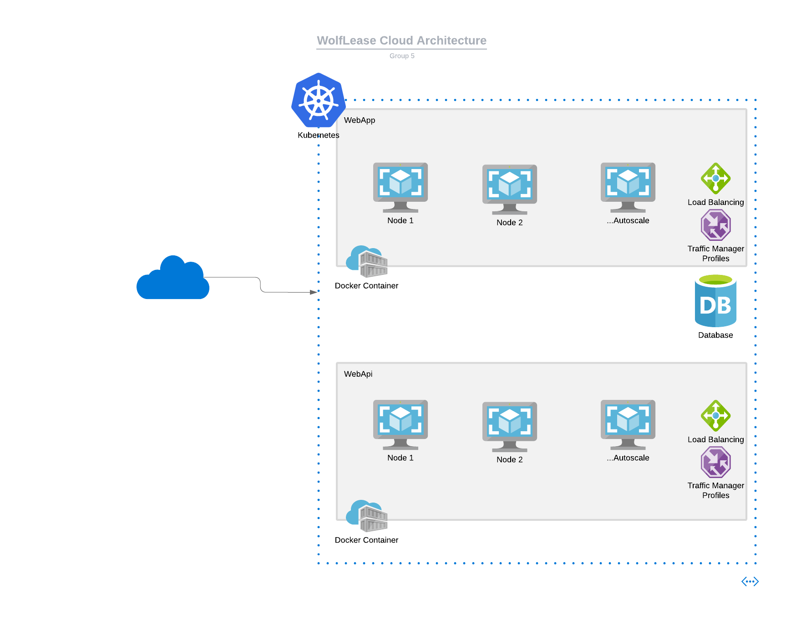

# Scalability

## Infrastructure

We designed a potential cloud architecture for the application that would ensure application can handle increased traffic, simultaneous access and irregular load.

The following components are included in this architecture:

1. Both the WebApp and WebApi are published as docker images to [GitHub packages](https://github.com/orgs/CSC510-Group-5/packages?repo_name=WolfLease).
2. These docker images are then deployed to kubernetes as nodes with autoscaling enabled to ensure that nodes can be scaled up and down as needed based on the usage.
3. The kubernetes is configured with traffic manager and load manager to ensure the traffic is uniformly distributed among the available nodes.

## Developer Time

Another aspect of scalability that we have taken into account is the developer time. We configured various pillars of DevOps to ensure that the time spent my developers on trivial things is eliminated. The following components are implemented:

1. Continuous Integration Checks: These checks include [security checks](https://github.com/CSC510-Group-5/WolfLease/actions/workflows/codeql-analysis.yml), [lint checks](https://github.com/CSC510-Group-5/WolfLease/actions/workflows/eslint.yml), [unit tests](https://github.com/CSC510-Group-5/WolfLease/actions/workflows/tests.yml), thus giving the developers instant feedback and allowing them to confidently merge new code into the repository.
2. Continuous Deployment: This ensures that the latest code is instantly pushed and deployed into production using GitHub actions. As soon as code is merged into the main branch, the workflow runs to publish these changes as a new docker image in GitHub packages which is then pulled by the cloud resources like Kubernetes.